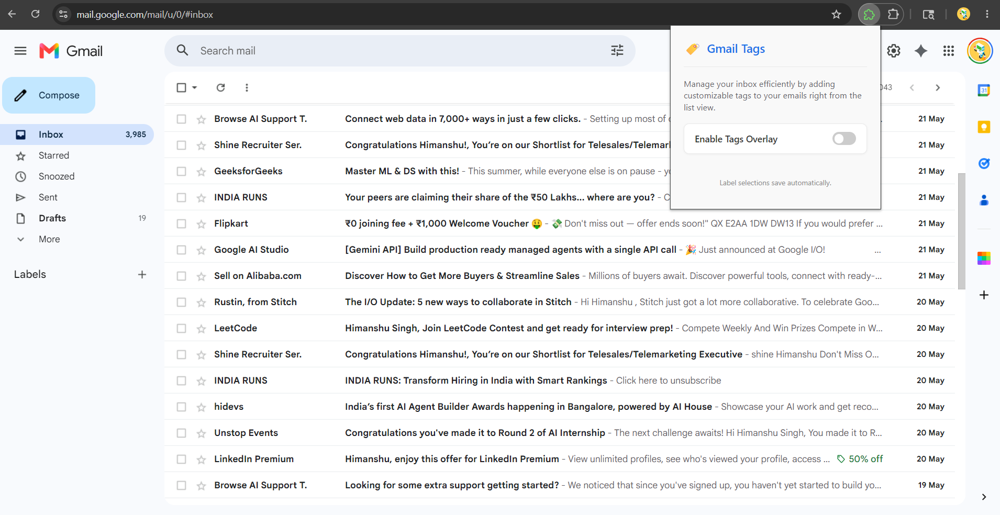
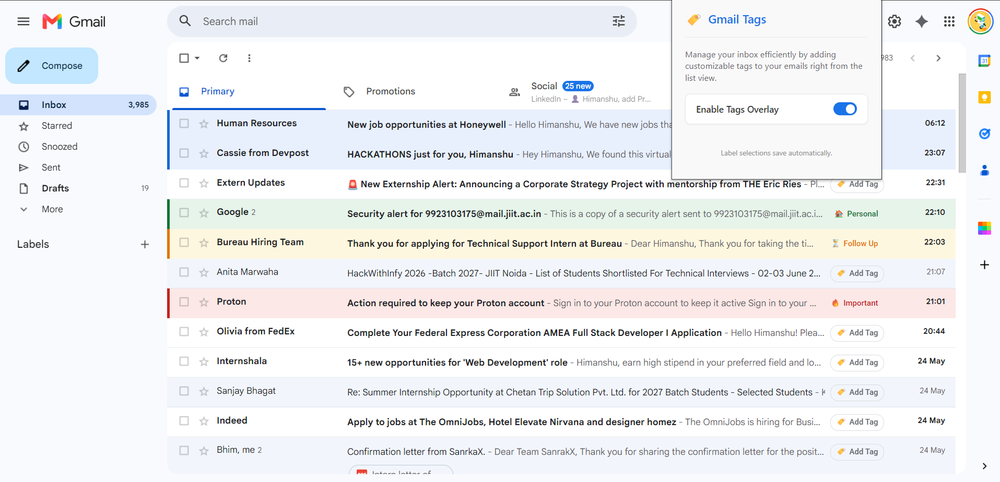

# 🏷️ Gmail Tags Extension

A lightweight, visually appealing Chrome extension built with [WXT](https://wxt.dev/) and React that enhances your Gmail inbox. It allows you to assign color-coded tags to any email thread directly from the list view, tinting the whole row so you can instantly recognize important tasks, follow-ups, and more.

## 📸 Screenshots

### Before
<p align="center">
  
</p>

### After
<p align="center">
  
</p>

## ✨ Features

- **Inline Tagging**: Adds a native-feeling dropdown chip right next to the email subject.
- **Visual Row Highlighting**: Selecting a tag gently tints the entire email row with a pastel background and adds a sleek left accent border for instant recognition.
- **Built-in Categories**: Comes pre-configured with stylish tags like `Important` (Red), `Follow Up` (Orange), `Work` (Blue), and `Personal` (Green).
- **Global Toggle**: Use the beautifully designed extension popup to instantly enable or disable the tags overlay without having to refresh your inbox. 
- **Persistent Storage**: Tags are saved automatically using `chrome.storage.local`, ensuring they remain exactly as you left them across reloads and different tabs.
- **Lightweight & Performant**: Deeply optimized DOM injection using a single global stylesheet and innerHTML templating to keep Gmail running fast.

## 🛠️ Tech Stack

- **[WXT](https://wxt.dev/)**: Next-gen framework for building browser extensions.
- **React**: Used for building the sleek, iOS-inspired popup interface.
- **TypeScript**: Ensures type safety and solid code architecture.
- **Vite**: Super-fast build tooling under the hood.

## 📁 Project Structure

```text
.
├── entrypoints/
│   ├── background.ts      # Extension background service worker
│   ├── content.ts         # Main logic: Injects tags and logic directly into Gmail's DOM
│   └── popup/             # React based popup UI
│       ├── App.tsx        # Popup logic to toggle the overlay
│       ├── App.css        # Clean, modern CSS for the popup
│       └── index.html     
├── public/                # Static assets (icons)
├── wxt.config.ts          # WXT configuration
└── package.json           # Dependencies and scripts
```

## 🚀 Getting Started

### Prerequisites
Make sure you have [Node.js](https://nodejs.org/) installed.

### Installation & Development

1. **Clone or download the project** to your local machine.
2. **Install dependencies**:
   ```bash
   npm install
   # or
   pnpm install
   ```
3. **Start the development server**:
   ```bash
   npm run dev
   # or
   pnpm run dev
   ```
   This will open a new instance of Chrome with the extension loaded into it automatically. Navigate to `mail.google.com` to see it in action.

### Building for Production

To create a production build of the extension:
```bash
npm run build
# or
pnpm run build
```
This generates an output folder (usually `.output/`) containing the unpacked extension ready to be published to the Chrome Web Store.

## 💡 How to Use

1. Open Gmail.
2. Look for the `Add Tag` chip next to the subject lines in your inbox.
3. Click on the chip to open a hidden native dropdown menu.
4. Select a tag (e.g., `Important`).
5. Watch the row beautifully transform with a custom background color and left border accent!
6. Click the extension icon in your browser toolbar to open the popup, where you can toggle the entire feature on or off.

## 📜 License

MIT
